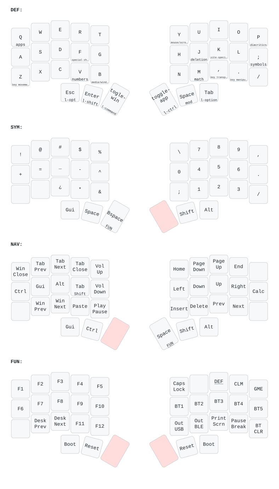

#+title: Karabiner keyboard configuration
#+author: Pablo Stafforini

* Editing source

[[file:modifications.org][modifications.org]] is the literate source and the full manual for this
keyboard system. It explains the firmware/software split, hardware setup,
Goku installation, device conditions, thumb-key behavior, simlayers, symbols,
and Emacs-specific bindings. Behavioral changes should begin there.

The Org file tangles to [[file:karabiner.edn][karabiner.edn]], which is the Goku input selected by
=$GOKU_EDN_CONFIG_FILE= in the shell configuration. Do not edit the generated
EDN as though it were an independent source. [[file:karabiner.json][karabiner.json]] is a tracked
Karabiner JSON snapshot and likewise is not the literate editing source.

* Layout diagrams

[[file:generate-layouts.py][generate-layouts.py]] parses the simlayer definitions in =modifications.org=,
writes keymap-drawer YAML under [[file:layouts/][layouts/]], and renders the matching SVG
files. The root [[file:layout.yaml][layout.yaml]] and  are older derived layout files rather
than another source of key behavior; the current generator owns the files under
=layouts/=. Regenerate those diagrams after changing a binding that they
represent:

#+begin_src sh
python3 karabiner/generate-layouts.py
#+end_src

The generator also copies rendered images to its configured website checkout
path. That copy is outside this repository and is not part of Karabiner
activation.

* Historical state and supporting files

[[file:automatic_backups/][automatic_backups/]] contains old application-created Karabiner snapshots.
They are retained as history and are not loaded as the current configuration.
[[file:assets/complex_modifications/][assets/complex_modifications/]] contains imported rule assets, while
[[file:Brewfile][Brewfile]] records the related macOS packages.

The Moonlander firmware export is documented separately in
[[file:../moonlander/README.org][the Moonlander README]]. The current contract between keyboard thumb keycodes
and the Karabiner layer is authoritative in =modifications.org=.
